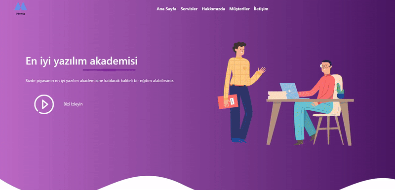

<h1>Udemig-Boostrap</h1>

Udemig Boostrap projesi Html, Css ve Boostrap kullanılarak geliştirilmiş bir eğitim platform uygulamasıdır.Kullanıcı dostu arayüzü ve responsive tasarımı ile her cihazda uyumlu bir deneyim sunar

<h1>Proje Özellikleri

 Kullanıcı Dostu Arayüz: Basit ve etkili bir tasarım ile kullanıcı deneyimi optimize edilmiştir.

 Responsive Tasarım:Tüm cihaz boyutlarında (mobil, tablet ,masaüstü) uyumlu çalışır.

Boostrap ile Tasarım: Grid sistemi ile Boostrap komponentleri kullanılarak geliştirildi.

Modern ve Temiz Kodlama: Proje sırasında en iyi uygulamalar benimsemiştir.

<h1>Kullanılan Teklonojiler</h1>

